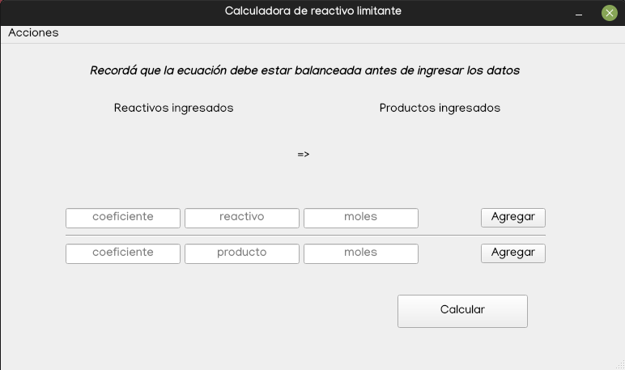
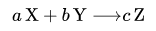

# Calculadora de reactivo limitante
Identifica el reactivo limitante en una ecuación química

## Utilización

Se deben agregar los reactivos y productos que componen la reacción completando los campos *coeficiente*, *reactivo* (fórmula química del compuesto), *moles* (disponibilidad del compuesto) y presionando el botón **agregar**.

Al presionar el botón **Calcular** se mostrará en la parte inferior un mensaje con el reactivo limitante de la reacción química.

## Consideraciones

Antes de ingresar los reactivos es necesario contar con la ecuación **correctamente balanceada**

Se debe tener en cuenta que aunque normalmente si el coeficiente de un compuesto es 1 no se coloca, para el correcto funcionamiento del programa es necesario colocar el numero 1 dentro del campo *coeficiente*.

El cálculo del reactivo limitante se realiza teniendo en cuenta que el rendimiento de la reacción es menor al 100% y según la siguiente ecuación:

Siendo **X** e **Y** reactivos, **Z** productos y *a*, *b* y *c*, sus respectivos coeficientes estequiométricos. 

Si

entonces **X** es el reactivo limitante.